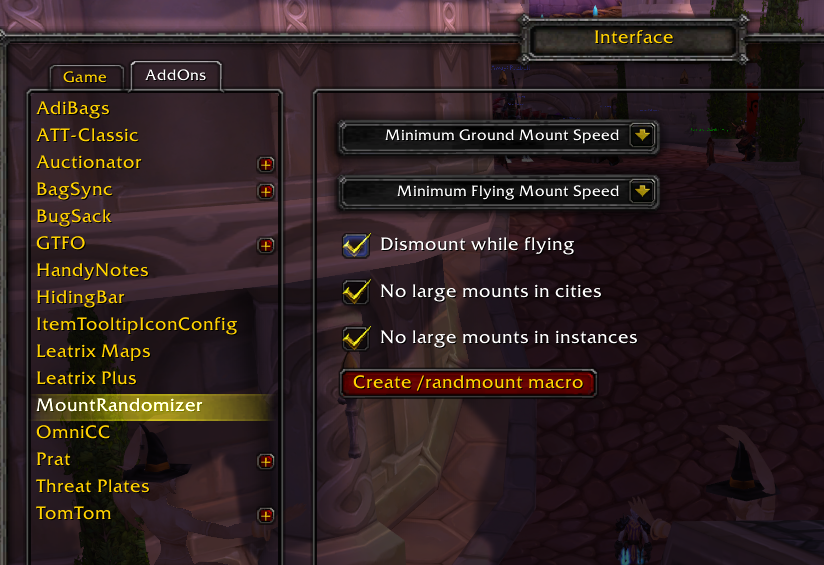
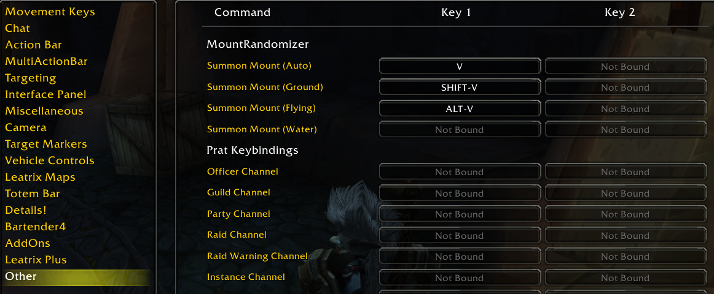

# MountRandomizer
World of Warcraft add-on for summoning random mounts.

## Pre-Release Usage Instructions

### Setup

1.  Unzip to `...\World of Warcraft\_classic_\Interface\AddOns\`.
1.  Which type (eg. apprentice/journeyman/expert/master) of mounts to randomly summon from can be
    set in the interface options.
    -   By default, only very fast mounts will be summoned for ground and flying.
    -   Flying mounts are always summoned when able.
    
1.  Set up keybindings.
    
1.  Create a macro that calls `/randmount` and add to action bar (can also just be invoked from
    chat).
    -   `/randmount <ground|flying|water>` to force summon a specific type.

### Blacklisting

To add a mount to the blacklist and prevent it from being summoned:
-   `/run MountRandomizer:BlacklistMount(<mount id>)`

For example, to blacklist the TBC boosty mount:
-   `/run MountRandomizer:BlacklistMount(176708)`

If you want to remove it from the blacklist:
-   `/run MountRandomizer:RemoveMountFromBlacklist(176708)`

## TODO for v1.0

- [ ] upload to curse
- [x] handle cold-weather flying
- [x] handle water mounts
- [x] set up automatic packaging workflow
- [x] handle profession-specific mounts
- [x] move `creatureSpellID` lookup tables to separate file
- [x] fall back on ground mounts if journal has no flying mounts while in flyable area
- [x] improve handling of empty mount journal
- [x] clean up redundant syntax, especially around population of `mountSpellPool`
- [x] improve interface options panel
    - [x] add button to print out mounts that are not found in lookup tables (use
          `/randmount printunknown`)
    - [x] add button to automatically create a macro for invoking from action bar
    - [x] correct size of dropdown lists
    - [x] add option for whether character should dismount while currently flying

## v1.0+ Potential Features

- [ ] weighting system to make favored mounts more likely to be selected
- [ ] weakaura creation:
    - [ ] party mount
    - [ ] party follow
- [ ] additional mount types/cases
    - [ ] handle AQ mounts
    - [ ] handle loaned flying mounts in northrend
- [ ] add debugging
- [ ] make localization-friendly